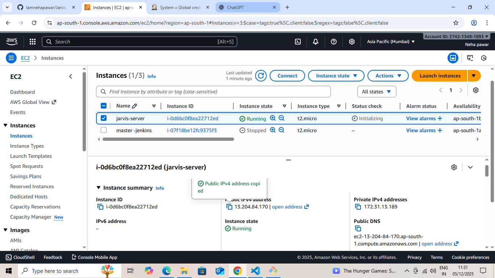
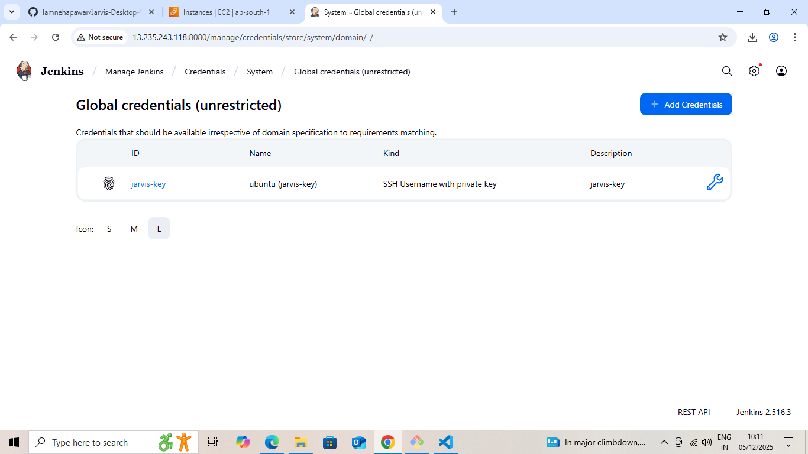
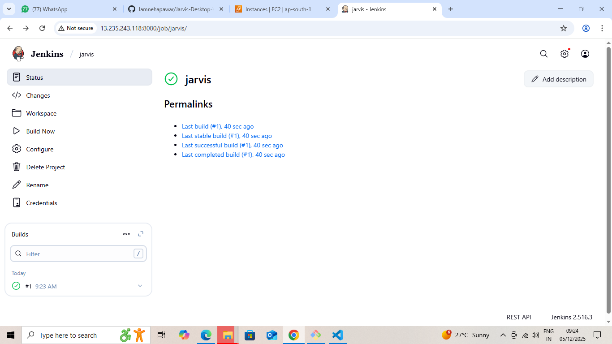
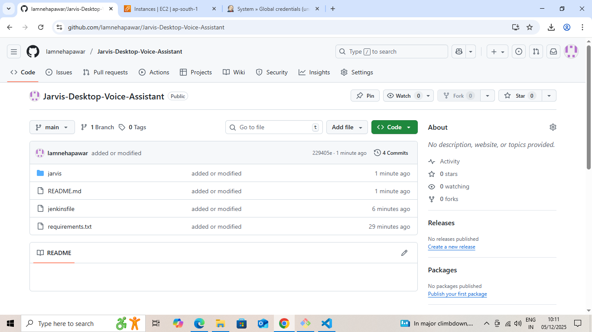

# Deploy Jarvis Voice Assistant on EC2 with Terraform & Jenkins

This README.md provides a complete, step-by-step guide to deploy the **Jarvis Desktop Voice Assistant** on AWS EC2 using Terraform, Jenkins, and GitHub webhooks for automated CI/CD.

---

##  Overview

This project automates deployment using: Terraform → Creates EC2 instance, Security Group, and Key Pair; EC2 Setup → Installs Jenkins automatically via user_data.sh; GitHub + Jenkins → Webhook-based CI/CD; SSH Credentials → Secure deployment; Jenkins Pipeline → Auto-deploy Jarvis on push.

---

##  1. Terraform Setup

###  File Structure
terraform/
- main.tf
- variables.tf
- provider.tf
- outputs.tf
- user_data.sh

###  main.tf
Defines EC2 instance and Security Group using variables.

###  variables.tf
variable "aws_region" { default = "ap-south-1" }  
variable "ami" { default = "ami-02b8269d5e85954ef" }  
variable "instance_type" { default = "t2.micro" }  
variable "key_name" { default = "jarvis-key" }  
variable "allowed_cidr" { default = "0.0.0.0/0" }  

###  provider.tf
provider "aws" { region = var.aws_region }

###  outputs.tf
output "public_ip" { value = aws_instance.jarvis_instance.public_ip }

###  user_data.sh
#!/bin/bash  
apt update -y  
apt upgrade -y  
apt install -y git python3 python3-venv python3-pip rsync curl openjdk-11-jdk  
mkdir -p /home/ubuntu/jarvis  
chown -R ubuntu:ubuntu /home/ubuntu/jarvis  

###  Deploy Terraform
cd terraform  
terraform init  
terraform plan -var 'ami=ami-02b8269d5e85954ef' -var 'key_name=jarvis-key'  
terraform apply  

> "Terraform successfully applied. EC2 instance created with public IP:"

---

##  2. Jenkins Installation on EC2

SSH into instance:  
ssh -i key.pem ubuntu@13.204.84.170

Install Jenkins:
sudo apt update  
sudo apt install -y openjdk-11-jdk  
wget -q -O - https://pkg.jenkins.io/debian-stable/jenkins.io.key | sudo apt-key add  
sudo sh -c 'echo deb https://pkg.jenkins.io/debian-stable binary/ > /etc/apt/sources.list.d/jenkins.list'  
sudo apt update  
sudo apt install -y jenkins  
sudo systemctl enable jenkins  
sudo systemctl start jenkins  

Access Jenkins: http://13.201.84.176:8080  

Initial Password: sudo cat /var/lib/jenkins/secrets/initialAdminPassword  

> 

---

##  3. Jenkins Pipeline (Jenkinsfile)

pipeline {  
  agent any  
  environment {  
    REMOTE_USER = "ubuntu"  
    REMOTE_HOST = "13.204.84.170"  
    REMOTE_DIR  = "/home/ubuntu/jarvis"  
    CRED_ID     = "jarvis-key"  
  }  

  stages {  
    stage('Checkout') {  
      steps {  
        git branch: 'main', url: 'https://github.com/Iamnehapawar/Jarvis-Desktop-Voice-Assistant.git'  
      }  
    }  
     
     
     stage('Package & Transfer') {  
      steps {  
        sshagent(credentials: ["${CRED_ID}"]) {  
          sh '''  
            ssh -o StrictHostKeyChecking=no ${REMOTE_USER}@${REMOTE_HOST} "mkdir -p ${REMOTE_DIR}"  
            rsync -avz --delete --exclude='.git' ./ ${REMOTE_USER}@${REMOTE_HOST}:${REMOTE_DIR}/  
          '''  
        }  
      }  
    }  

    stage('Remote: Setup & Restart') {  
      steps {  
        sshagent(credentials: ["${CRED_ID}"]) {  
          sh "ssh -o StrictHostKeyChecking=no ${REMOTE_USER}@${REMOTE_HOST} 'cd ${REMOTE_DIR} && ./setup_and_restart.sh'"  
        }  
      }  
    }  
  }  
}  

>

---

##  4. GitHub Webhook Setup

Go to GitHub → Repo → Settings → Webhooks → Add Webhook  
Payload URL: http://13.201.84.176:8080/github-webhook/  
Content Type → application/json  
Trigger → Just Push  

> 

---

##  5. Add Jenkins SSH Credentials

Jenkins → Credentials → Global → Add Credentials  
Type → SSH Username with Private Key  
Username → ubuntu  
Private Key → Paste PEM  
ID → jarvis-key  

>  "SSH key added in Jenkins for secure remote access:"

---

##  6. Deployment

Create Job → Pipeline from SCM → Select Repo → Add Jenkinsfile Path  
Every push → automatic deployment  

 "Pipeline completed successfully and Jarvis is running on EC2:"
 

---

## 7. Github Push

##  Project Highlights

- Fully automated infrastructure provisioning with Terraform  
- CI/CD pipeline with Jenkins + GitHub webhooks  
- Secure deployment using SSH keys and restricted security groups  
- Flexible configuration using variables.tf (AMI, instance type, region, etc.)  
- Easy to scale: Just update Terraform variables to launch more EC2 instances

---

##  Best Practices Followed

1. Idempotent Terraform scripts → safe to re-run without breaking existing resources 

2. Security-first approach → SSH access controlled, only necessary ports open 

3. Separation of concerns → Infrastructure (Terraform) and Application (Jenkins pipeline) clearly divided 

4. Reusable pipeline → Same Jenkinsfile works for updates, not just first deployment

---

##  Optional Enhancements

- Add HTTPS using AWS Certificate Manager and Nginx for secure Jarvis web access  
- Integrate Slack or Discord notifications on pipeline completion  
- Use Terraform modules for reusable and modular infrastructure  
- Enable auto-scaling group to handle higher load if multiple users are expected

---

## Author :

  
Email: nehapawar29005@gmail.com  
GitHub: https://github.com/Iamnehapawar

---

